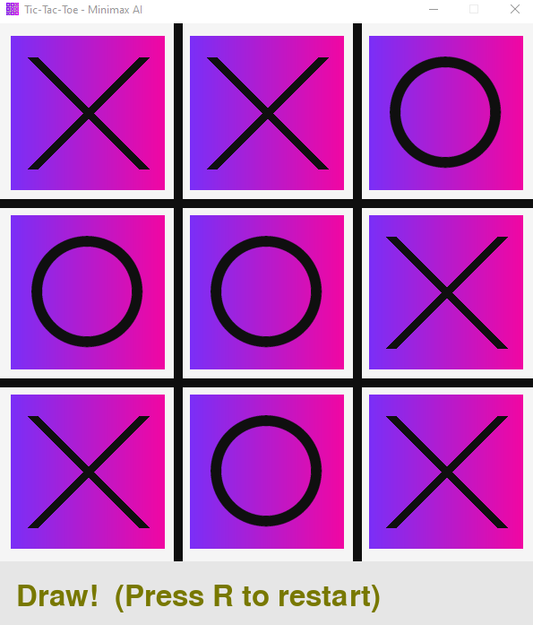

# Tic-Tac-Toe (Pygame + Minimax with Alpha–Beta, printed metrics)



A minimalist Tic-Tac-Toe with a clean Pygame UI and a **perfect-play AI** powered by **minimax** + **alpha–beta pruning**.  
The AI prints search metrics (nodes, leaves, cutoffs, α/β window) to the console at every computer turn.

---

## Features

- 🎮 Pygame UI (gradient tiles, bold grid, crisp anti-aliased O’s)
- 🧠 Minimax + alpha–beta pruning (optimal play)
- 📊 Console metrics per root move:
  - nodes visited, terminal leaves, cutoffs (prunes), α/β window updates
- 🔧 Easy to tweak visuals via constants

---

## Getting Started

### Requirements

Create Virtual Environment:

    uv init

Install:

    uv add pygame

Run:

    uv run main.py

### Controls
- **Left-click** a square to place **O**.
- **R** – restart game
- **ESC** / close window – quit

---

## How the Board Is Represented

The board is a dict keyed by positions **1..9**:

    1 | 2 | 3
    --+---+--
    4 | 5 | 6
    --+---+--
    7 | 8 | 9

- Empty cells contain `' '`
- Player is **'O'**, computer is **'X'**

---

## Algorithms

### Minimax (with depth-aware scoring)
At any position, minimax explores the game tree to pick the move that maximizes the computer’s outcome assuming the opponent plays optimally.

**Terminal scoring** (from X’s perspective):

- X wins  → `REWARD - depth` (win sooner = slightly better)
- O wins  → `-REWARD + depth` (loss later = slightly less bad)
- Draw    → `0`

In this project, `REWARD = 10`.  
Because Tic-Tac-Toe is small, this exact evaluation (no heuristics) is enough for perfect play.

### Alpha–Beta Pruning
Alpha–beta maintains two bounds during depth-first search:

- **α (alpha)** = best score found so far along the **maximizer** (X) path  
- **β (beta)**  = best score found so far along the **minimizer** (O) path

Whenever `α ≥ β`, the branch cannot influence the final decision and is **pruned** (cut off), saving work while keeping the result exact.

This project logs, per root move:

- nodes expanded in that subtree  
- terminal leaves evaluated  
- number of cutoffs (prunes)  
- α/β window tightening

### Sample console output (illustrative)

    === Computer turn (X) ===
    Board:
    X| | 
    -+-+-
     |O| 
    -+-+-
     | | 

    Remaining action space (legal moves): [3, 4, 6, 7, 8, 9]
      Move 3: score=  0 | nodes=  28 leaves=  10 cutoffs=  4 | αβ -inf,+inf ->   0,+inf
      Move 4: score=  0 | nodes=  26 leaves=   9 cutoffs=  3 | αβ   0,+inf ->   0,+inf
      ...
    Best choice: move 3 with score 0
    Totals: nodes=150, leaves=55, cutoffs=20, max_depth=9, time=3.21 ms
    === End of evaluation ===

---

## Code Map

- **`TicTacToe`**
  - `place(player, position)` – mutates board if cell is free
  - `is_winning(player)` / `is_draw()` – terminal checks
  - `free_positions()` – list of empty cells
  - `best_move(verbose=True)` – evaluates each legal root move, prints metrics, returns the best move
  - `_minimax(depth, alpha, beta, is_maximizer, stats)` – recursive minimax with alpha–beta and stats

- **UI helpers**
  - Gradient tile rendering (`make_horizontal_gradient_surface`, `draw_pretty_board`)
  - Crisp **O** via supersampled/AA sprite (`make_ring_sprite`)
  - `draw_marks` – draws X and O
  - Input → board cell mapping

---

## Customization

All visuals live in constants near the top of the UI section:

```python
GRID_SIZE = 600
INFO_HEIGHT = 80
LINE_WIDTH = 10
MARK_WIDTH = 12
TILE_MARGIN = 14
PADDING = 38

PURPLE = (123, 47, 247)
PINK   = (241, 7, 163)
INK    = (15, 15, 15)
